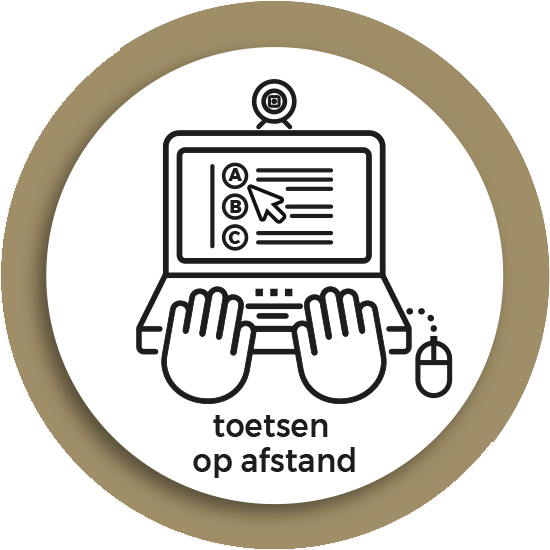

```{r setup, include=FALSE}
library(flexdashboard)

# if(!"collapsibleTree" %in% installed.packages()) { install.packages("collapsibleTree") };
if(!"data.tree"       %in% installed.packages()) { install.packages("data.tree")       };
if(!"readxl"          %in% installed.packages()) { install.packages("readxl")          };
# library("collapsibleTree")
library("readxl")
library("data.tree")
```

Column {data-width=650}
-----------------------------------------------------------------------

### Uitleg

**Over de tool** 

De afgelopen jaren is er in het hoger onderwijs toenemende aandacht voor toetsbekwaamheid. Toetsbekwaamheid maakt in het hbo expliciet onderdeel uit van de Basiskwalificatie Didactische Bekwaamheid (BDB, vergelijkbaar met BKO in wo). Alle hbo-docenten moeten dan ook beschikken over de zogenoemde ‘basiskwalificatie examinering’ (bke) die onderdeel is van de BDB. In het project ‘Je Ogen Uitkijken’ worden momenteel kennis, handvatten en tools ontwikkeld om ‘voortdurende toetsbekwaamheid’ in het hoger onderwijs te ondersteunen. Het instrument ‘Bewust en bekwaam toetsen en beoordelen’ kan hier een mooie bijdrage aan leveren. 

De tool bestaat uit een conceptmap waarin het concept 'toetsing' wordt geoperationaliseerd. Bij elk onderdeel van de conceptmap hoort een kennistoets. Ook bevat de tool een overkoepelende kennistoets voor het gehele concept 'toetsing'. 

### Conceptmap

```{r, echo=FALSE, eval=FALSE}
# Read .xlsx file
assessment.tree <- read_excel("assessment_tree.xlsx")

assessment.tree$tooltip <- paste(assessment.tree$application, '<br><a href="">klik</a>')

# Create tree
collapsibleTree(assessment.tree,
                root        = "Question Type",        # Specify root name. This can be any string
                hierarchy   = c("question.type",
                                "question.options",
                                "assessment.type"), # Use column headers from .xlsx file as branches
                width       = 800,                    # Set width in pixels
                fontSize    = 11,                      # Set font size
                tooltip     = TRUE,
                tooltipHtml = "tooltip"
               )
```

```{r, echo=FALSE, eval=FALSE}
# Create a simple org chart
org <- data.frame(
  Manager = c(
    NA, "Ana", "Ana", "Bill", "Bill", "Bill", "Claudette", "Claudette", "Danny",
    "Fred", "Fred", "Grace", "Larry", "Larry", "Nicholas", "Nicholas"
  ),
  Employee = c(
    "Ana", "Bill", "Larry", "Claudette", "Danny", "Erika", "Fred", "Grace",
    "Henri", "Ida", "Joaquin", "Kate", "Mindy", "Nicholas", "Odette", "Peter"
  ),
  Title = c(
    "President", "VP Operations", "VP Finance", "Director", "Director", "Scientist",
    "Manager", "Manager", "Jr Scientist", "Operator", "Operator", "Associate",
     "Analyst", "Director", "Accountant", "Accountant"
  )
)

# Add in colors and sizes
org$Color <- org$Title
levels(org$Color) <- colorspace::rainbow_hcl(11)

# Use unsplash api to add in random photos to tooltip
org$tooltip <- paste0(
  org$Employee,
  "<br>Title: ",
  org$Title,
  "<br>"
)

collapsibleTreeNetwork(
  org,
  attribute = "Title",
  fill = "Color",
  nodeSize = "leafCount",
  tooltipHtml = "tooltip"
)
```


```{r}
# install.packages("devtools") # if you have not installed "devtools" package
# devtools::install_github("ShKlinkenberg/collapsibleTree")
library("collapsibleTree")

assessment.network <- read_excel("assessment_network.xlsx")

tooltip.text = '<h3>%s</h3>\n<p>%s</p>\n<p>Go <a href="%s">Here</a></p>'

assessment.network$tooltip <- sprintf(tooltip.text, 
                                      assessment.network$title, 
                                      "Look at this", 
                                      "https://www.surf.nl")

collapsibleTreeNetwork(
  assessment.network,
  attribute = "title",
  tooltipHtml = "tooltip",
  zoomable = FALSE
)
```


Column {data-width=350}
-----------------------------------------------------------------------

### Overige informatie

**Actualisatie en ontsluiting van het instrument door:**

* Kelly Beekman (Fontys, projectleider)
* Tamara van Schilt-Mol (HAN)
* Desirée Joosten-ten Brinke (OU)
* Masterstudent Toetsdeskundige

[**SURF Werkgroep Toetsen op Afstand**](https://www.versnellingsplan.nl/werkgroep-toetsen-op-afstand/)

```{r, out.width='100%', fig.align='center'}

```
